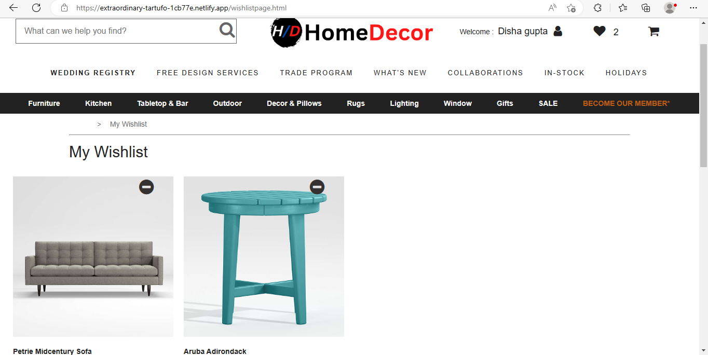
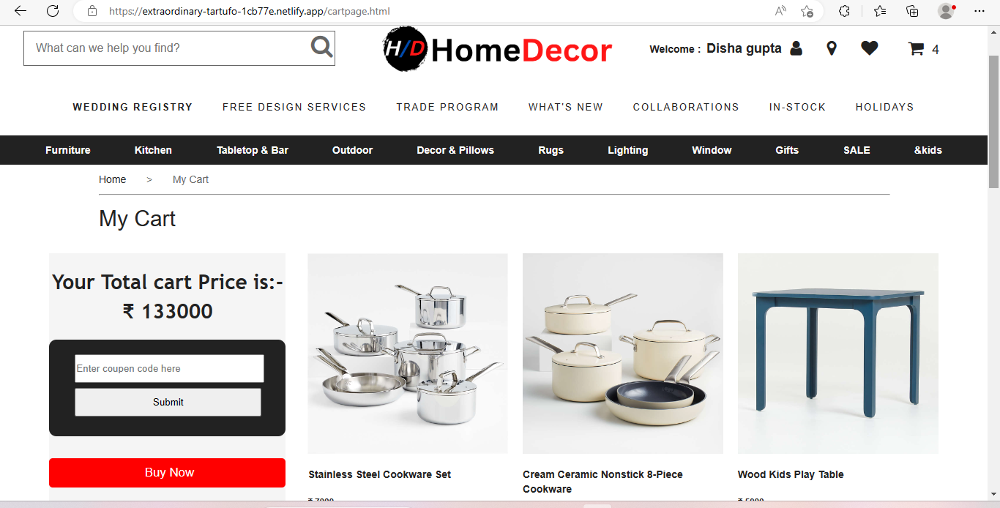
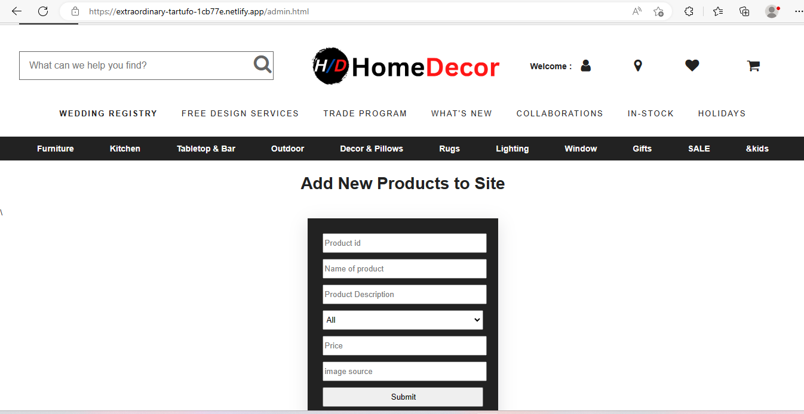

# Home Decor 

### Home Decor is a online-e-commerce website for customised furnitures. An Collaborative project built and executed in 5 days.
 

## Tools:

  

 
  
 

## Deployed Link:
**Main Website:** https://extraordinary-tartufo-1cb77e.netlify.app/

---
 

##  Website:

### Pages

* Authentication Page
* Home Page
* Product Page
* Cart Page
* Wishlist page
* Admin Page

### Features

* Responsive
* Search
* Responsive
* filtering 
* Sorting
* Authentication using local Storage
* Adding Production
* Discount
* Buying, Increase and Decrease Quantity

  

## Some Glimpses of Website

---

### Homepage
 

----

### Wislist Page
 

----

### Cart Page
 

----

### Add Product page
 

---
 

   
